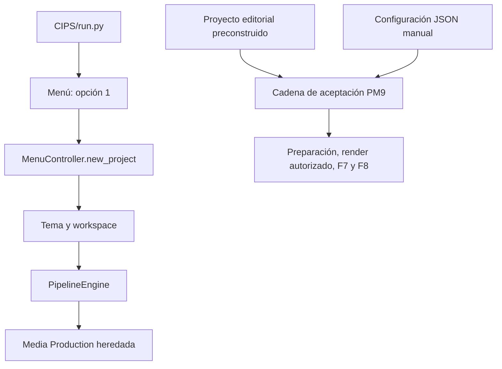
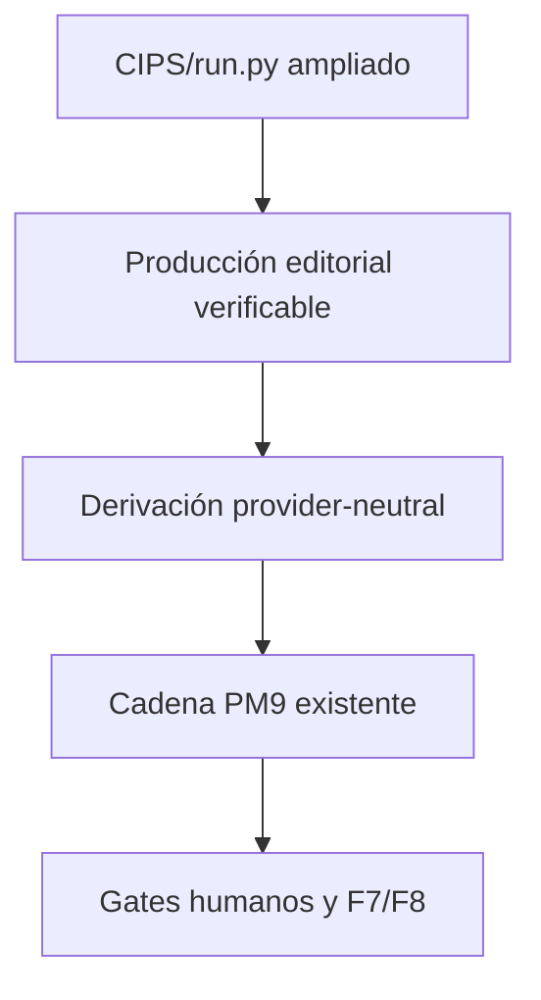

---
document:
  id: FAO-OPS-001
  title: Contrato Operativo y Baseline Reproducible de FAO
  version: 1.0.1
  status: APPROVED
  classification: Production System Contract
  owner: ConsejoIA_V5 Architecture
  repository: ConsejoIA_V5
---

# 1. Propósito

Esta especificación define el contrato operativo que deberá cumplir
`FAO — Automatización Operativa End-to-End` y documenta la brecha reproducible
existente al cierre de PM9.

El contrato separa la experiencia objetivo de su implementación. FAO.1 no une
los pipelines ni cambia su comportamiento: fija entradas, salidas, gates
humanos, estados, invariantes y evidencia de baseline para que FAO.2 pueda
implementar la integración desde el punto de entrada oficial existente sin
reinterpretar el objetivo.

# 2. Alcance

FAO comienza con un tema nuevo y termina con un MP4 revisable, una decisión F7
y evidencia F8. Durante FAO la publicación permanece desactivada.

FAO.1 comprende exclusivamente:

- el contrato operativo versionado `cips.fao.operational_contract` 1.0;
- el mapa de los dos pipelines actuales desde `CIPS/run.py`;
- el diagnóstico `cips.fao.operational_baseline` 1.0;
- una prueba estática, determinista y offline de la separación actual.

FAO.1 no amplía ni conecta la entrada oficial existente, no genera un proyecto
nuevo, no invoca proveedores, no consume créditos, no renderiza y no publica.

# 3. Objetivos

## 3.1 Objetivo maestro de FAO

Permitir que una persona no experta introduzca un tema y preferencias, opere la
producción completa sin editar archivos internos ni depender del LLM como
orquestador humano, y obtenga un MP4 con trazabilidad técnica y editorial.

## 3.2 Objetivos de FAO.1

1. Definir una frontera estable y provider-neutral.
2. Distinguir con evidencia el pipeline que recibe un tema del pipeline PM9.
3. Formalizar las únicas decisiones que pertenecen al operador.
4. Definir estados observables y reanudables para las siguientes subfases.
5. Conservar todos los gates y garantías cerrados en PM9.

# 4. Arquitectura General

## 4.1 Baseline comprobado



La entrada oficial y la captura del tema ya existen. No existe una frontera que
conecte esa ruta operativa con la cadena PM9.

## 4.2 Arquitectura objetivo



FAO.2 reutilizará y ampliará la entrada oficial existente; no creará otro CLI o
menú paralelo. FAO.1 sólo fija el contrato que gobernará esa integración.

# 5. Componentes

## 5.1 Contrato ejecutable

`08_SCRIPTS/fao_operational_baseline.py` expone:

- `build_operational_contract()` para obtener el contrato 1.0;
- `inspect_operational_baseline()` para diagnosticar la brecha;
- un CLI que emite evidencia JSON legible por herramientas.

## 5.2 Pipeline oficial de entrada por tema

| Propiedad | Valor comprobado |
|---|---|
| Entrada principal | `CIPS/run.py:main` |
| Menú | `build_menu()` declara `1 — Nuevo Proyecto` |
| Despacho | `MenuController.dispatch("1") → new_project` |
| Dato inicial | `new_project` solicita `tema` |
| Workspace | `ProjectManager.create_project(tema)` |
| Editorial | `PipelineEngine` |
| Multimedia | `ejecutar_media_production` heredado |
| Cadena PM9 | no invocada |
| F7/F8 PM9 | no integradas |

Ruta comprobada:

```text
CIPS/run.py → build_menu() → MenuController.dispatch("1")
→ MenuController.new_project → ProjectManager.create_project(tema)
→ PipelineEngine.execute() → ejecutar_media_production(project_path)
```

## 5.3 Pipeline de aceptación PM9

| Propiedad | Valor comprobado |
|---|---|
| Entrada | `run_pm9_full_production_acceptance.py` |
| Dato inicial | `--project` y configuración del proyecto |
| Tema nuevo | no aceptado |
| Editorial | debe existir antes de la ejecución |
| Configuración por escena | debe existir antes de la ejecución |
| Salida | preparación, render autorizado, F7 y F8 |

## 5.4 Prueba Fresh Project existente

`test_pm9_fresh_project_end_to_end.py` copia investigación, verificación, guion,
storyboard, narración, SEO, publicación y
`production_acceptance_config.json` desde el proyecto PM9 del cielo. Esta prueba
demuestra la cadena de producción desde un proyecto preparado; no demuestra
tema nuevo → MP4.

# 6. Flujo de Operación

## 6.1 Entradas oficiales objetivo

| Entrada | Responsable | Obligatoria |
|---|---|---|
| `topic` | operador | sí |
| `platform` | operador | sí |
| `duration_seconds` | operador | sí |
| `audience` | operador | sí |
| `creative_style` | operador | sí |

La interfaz podrá ofrecer valores predeterminados, pero no podrá exigir rutas,
JSON, Markdown ni conocimiento de componentes internos.

## 6.2 Salidas oficiales objetivo

| Salida | Productor |
|---|---|
| workspace reanudable | CIPS |
| paquete editorial verificado | CIPS |
| `ProductionManifest` provider-neutral | CIPS |
| configuración de aceptación derivada | CIPS |
| catálogo F3 y sidecars | CIPS |
| subtítulos canónicos y conformidad acústica | CIPS |
| evidencia `ready_for_real_render` y costo | CIPS |
| MP4 revisable | proveedor autorizado + CIPS |
| decisión F7 | operador |
| evidencia/exportación F8 | CIPS |

## 6.3 Estados objetivo

| Estado | Checkpoint | Terminal |
|---|---:|---:|
| `topic_received` | sí | no |
| `project_created` | sí | no |
| `editorial_in_progress` | sí | no |
| `editorial_validated` | sí | no |
| `production_derived` | sí | no |
| `assets_ready` | sí | no |
| `ready_for_real_render` | sí | no |
| `awaiting_render_authorization` | sí | no |
| `rendering` | sí | no |
| `ready_for_review` | sí | no |
| `changes_requested` | sí | no |
| `approved` | sí | no |
| `cancelled` | sí | sí |
| `exported` | sí | sí |

# 7. Integración

## 7.1 Gates humanos

| Gate | Momento | Decisiones | Regla |
|---|---|---|---|
| costo de render | tras preparación | `authorize`, `reject` | proveedor y costo máximo explícitos; autorización de un solo uso |
| revisión final F7 | tras MP4 y QA | `approve`, `request_changes`, `cancel` | decisión auditable del operador |
| publicación | después de aprobación | `authorize`, `reject` | independiente y desactivada durante FAO |

## 7.2 Intervenciones humanas permitidas

1. Introducir tema, plataforma, duración, audiencia y estilo.
2. Autorizar o rechazar el costo cuantificado de un render.
3. Revisar el MP4 y tomar una decisión F7.

## 7.3 Acciones que no cuentan como automatización

- editar manualmente Markdown, JSON o Python;
- copiar respuestas de un LLM externo;
- seleccionar rutas internas;
- pedir al LLM que interprete o repare la ejecución normal;
- publicar durante FAO.

# 8. Restricciones

1. `ProductionManifest` permanece provider-neutral.
2. Free Tier es la política predeterminada.
3. Ningún crédito se consume sin autorización nueva, explícita y cuantificada.
4. `publication_performed` permanece en `false` durante FAO.
5. F3, F7, F8, hashes, sidecars, subtítulos y conformidad acústica se conservan.
6. La ejecución deberá ser idempotente y reanudable.
7. No se permiten hardcodes por tema, palabra, escena o proveedor.
8. La prueba de baseline no importa ni ejecuta los puntos de entrada auditados.

# 9. Validación

## 9.1 Diagnóstico reproducible

El diagnóstico analiza el AST de ocho archivos locales:

- `CIPS/run.py`;
- `08_SCRIPTS/menu.py`;
- `08_SCRIPTS/menu_controller.py`;
- `08_SCRIPTS/project_manager.py`;
- `08_SCRIPTS/pipeline_engine.py`;
- `11_MEDIA_PRODUCTION/media_pipeline.py`;
- `08_SCRIPTS/run_pm9_full_production_acceptance.py`;
- `08_SCRIPTS/tests/test_pm9_fresh_project_end_to_end.py`.

Para confirmar la brecha debe demostrar simultáneamente que:

1. `CIPS/run.py` construye el menú, instancia `MenuController`, recibe una opción
   y la despacha desde su guardia ejecutable;
2. `build_menu()` declara la opción `1 — Nuevo Proyecto`;
3. `dispatch("1")` enruta a `new_project`, que recibe el tema, crea el workspace,
   usa `PipelineEngine` y llama la producción multimedia heredada;
4. la ruta oficial no invoca la aceptación PM9;
5. PM9 recibe un proyecto, pero no un tema;
6. la prueba Fresh Project copia entregables editoriales y configuración;
7. no existe todavía el puente entre la entrada oficial y PM9.

La evidencia incluye SHA-256 de las fuentes inspeccionadas y declara siempre:

```json
{
  "inspection_mode": "static_ast",
  "network_called": false,
  "credits_used": 0,
  "render_performed": false,
  "publication_performed": false,
  "files_modified": false
}
```

## 9.2 Criterios de cierre de FAO.1

- contrato 1.0 versionado;
- entradas, salidas, gates y estados cubiertos por pruebas;
- brecha confirmada de forma determinista y offline;
- cero cambios en el comportamiento de PM9;
- pruebas focales y regresión aprobadas;
- `git diff --check` aprobado.

# 10. Roadmap

| Subfase | Uso de este contrato |
|---|---|
| FAO.2 | ampliar la entrada oficial existente y añadir checkpoints |
| FAO.3 | producir y validar el paquete editorial |
| FAO.4 | derivar manifest y configuración |
| FAO.5 | conectar la entrada con la cadena PM9 |
| FAO.6 | aplicar calidad, recuperación y diagnóstico |
| FAO.7 | ejecutar el ensayo integral controlado |
| FAO.8 | realizar la aceptación operada por el usuario |
| FAO.9 | cerrar FAO y decidir posteriormente sobre PM10 |

# 11. Historial de Cambios

| Versión | Fecha | Descripción |
|---|---|---|
| 1.0.0 | 2026-08-31 | Contrato operativo, mapa de pipelines y baseline reproducible de FAO.1. |
| 1.0.1 | 2026-09-01 | Corrige el baseline para partir de `CIPS/run.py` y recorrer la ruta oficial completa. |
