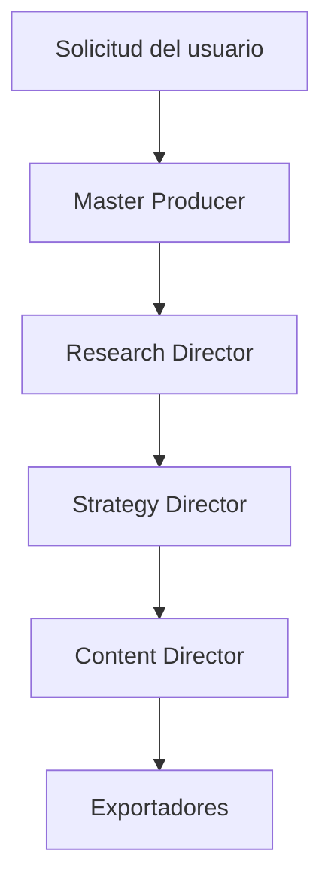
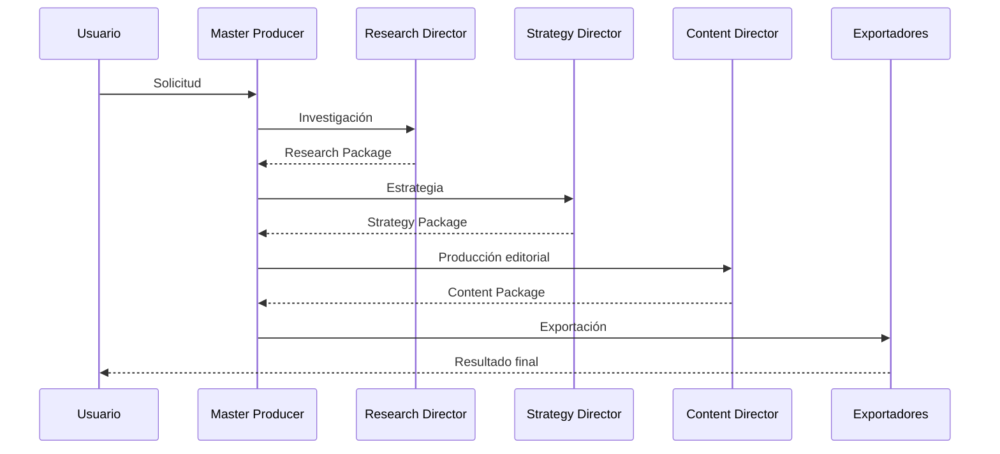
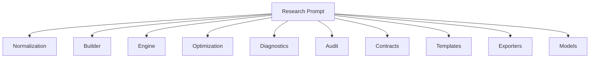
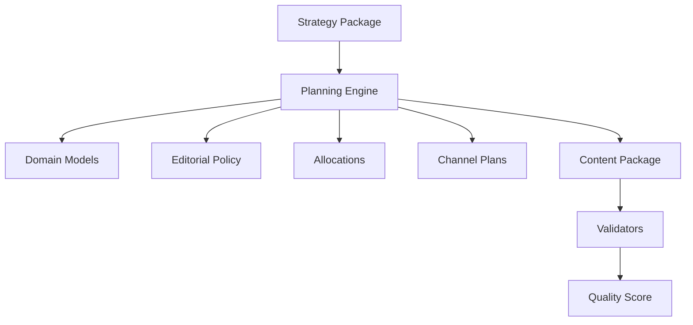

# 5. Arquitecturas Paralelas y Producción

El presente bloque documenta la arquitectura responsable de transformar una intención de negocio en un conjunto de artefactos completamente estructurados, auditables y preparados para su publicación. A diferencia de los bloques anteriores, centrados en la infraestructura base del sistema, este capítulo analiza el conjunto de módulos especializados que conforman el pipeline de producción de CIPS.

El análisis realizado demuestra que CIPS no implementa un flujo monolítico donde un único componente sea responsable de todas las transformaciones. Por el contrario, la solución adopta una arquitectura distribuida por dominios funcionales, donde cada módulo posee responsabilidades claramente delimitadas y se comunica mediante contratos de datos bien definidos. Este enfoque reduce el acoplamiento entre componentes, facilita la evolución independiente de cada subsistema y mejora significativamente la mantenibilidad del proyecto.

La evidencia obtenida del código fuente muestra una separación consistente entre las responsabilidades de investigación, estrategia, planificación editorial, producción de contenido, auditoría, validación y exportación. Cada una de estas capacidades se implementa mediante modelos de dominio específicos, motores de construcción, validadores y mecanismos de evaluación de calidad, lo que permite que el sistema mantenga un elevado nivel de trazabilidad durante todo el ciclo de producción. :contentReference[oaicite:0]{index=0}

---

# 5.1 Arquitectura General del Pipeline de Producción

El pipeline de producción constituye la columna vertebral de CIPS. Su función consiste en transformar progresivamente una solicitud del usuario en un conjunto de activos listos para ser utilizados por distintos modelos de lenguaje o sistemas externos.

Durante la revisión del código se identificó un patrón arquitectónico repetido en prácticamente todos los módulos especializados. Dicho patrón organiza el procesamiento mediante una sucesión de etapas claramente diferenciadas, donde cada una recibe un estado estructurado, realiza una transformación específica y entrega un nuevo estado enriquecido al siguiente componente.

Desde el punto de vista arquitectónico, este patrón puede representarse mediante el siguiente flujo lógico:


Cada transición del pipeline representa una frontera entre dominios funcionales. Ningún módulo modifica directamente el estado interno de otro; en su lugar, cada componente produce un objeto de dominio completamente definido que sirve como entrada del siguiente proceso. Esta decisión arquitectónica reduce el acoplamiento, facilita las pruebas unitarias y permite reemplazar módulos completos sin afectar el resto del sistema.

Una característica especialmente relevante es que la arquitectura no depende de un proveedor específico de inteligencia artificial. Los componentes generan estructuras intermedias independientes del modelo de lenguaje que posteriormente pueden exportarse hacia distintos formatos de consumo, permitiendo reutilizar el mismo pipeline para múltiples proveedores. Esta separación entre construcción y exportación constituye una decisión de diseño acertada para garantizar la portabilidad del sistema. :contentReference[oaicite:1]{index=1}

---

# 5.2 Principios Arquitectónicos Identificados

El análisis del código fuente permitió identificar una serie de principios de diseño que aparecen repetidamente en prácticamente todos los módulos del ecosistema CIPS.

## 5.2.1 Separación estricta de responsabilidades

Cada director especializado concentra únicamente la lógica correspondiente a su dominio.

Por ejemplo:

| Componente | Responsabilidad principal |
|------------|---------------------------|
| Master Producer | Orquestación global |
| Research Director | Construcción de investigación |
| Research Prompt Builder | Construcción del prompt de investigación |
| Strategy Director | Diseño estratégico |
| Content Director | Producción editorial |
| Exportadores | Conversión hacia proveedores externos |

Este enfoque evita la acumulación de responsabilidades dentro de una única clase o módulo y favorece la evolución independiente de cada subsistema.

---

## 5.2.2 Modelos de dominio como contrato

Todos los módulos trabajan sobre modelos de dominio explícitos.

El Content Director constituye uno de los mejores ejemplos de esta filosofía.

En lugar de intercambiar diccionarios genéricos, define un conjunto completo de entidades especializadas, entre ellas:

- ContentBrief
- AudienceSegment
- ContentObjective
- ContentPillar
- ChannelPlan
- ContentPiece
- EditorialCalendar
- ContentPackage
- ContentQualityScore

Cada una de estas entidades encapsula información específica del dominio editorial y proporciona mecanismos de serialización hacia estructuras estándar. :contentReference[oaicite:2]{index=2}

La utilización de modelos tipados aporta varias ventajas arquitectónicas:

- Validación temprana de datos.
- Contratos explícitos entre módulos.
- Mayor legibilidad del código.
- Menor dependencia de estructuras dinámicas.
- Facilita la serialización y persistencia.

---

## 5.2.3 Inmutabilidad del dominio

Otro patrón recurrente consiste en declarar prácticamente todas las entidades principales mediante:

```python
@dataclass(frozen=True, slots=True)
```

Esta decisión implica que, una vez construido un objeto de dominio, su estado no puede modificarse accidentalmente.

Desde la perspectiva arquitectónica esto proporciona múltiples beneficios:

- elimina efectos secundarios durante el pipeline;
- mejora la trazabilidad;
- facilita la ejecución concurrente;
- reduce errores por modificaciones inesperadas;
- simplifica el razonamiento sobre el flujo de datos.

La adopción sistemática de objetos inmutables constituye una práctica propia de arquitecturas modernas orientadas al dominio y representa una fortaleza importante del diseño observado. :contentReference[oaicite:3]{index=3}

---

## 5.2.4 Construcción incremental

Los distintos motores no generan directamente el resultado final.

En su lugar siguen una secuencia de etapas bien diferenciadas:

```text
Entrada

↓

Normalización

↓

Validación

↓

Construcción

↓

Optimización

↓

Diagnóstico

↓

Auditoría

↓

Exportación
```

Este patrón puede observarse claramente en el motor avanzado del Research Prompt Builder, donde el proceso realiza la normalización del contexto, optimiza objetivos, resuelve restricciones, expande preguntas, construye el paquete de investigación, aplica optimizaciones finales, calcula métricas de calidad y genera el resultado exportable. :contentReference[oaicite:4]{index=4}

La construcción incremental reduce significativamente la complejidad de cada componente individual y facilita la incorporación de nuevas capacidades sin alterar las etapas previamente implementadas.

---
# 5.3 Arquitectura del Master Producer

El Master Producer constituye el punto central de coordinación del pipeline de producción de CIPS. A diferencia de un controlador tradicional que concentra lógica de negocio, este componente actúa como un orquestador de alto nivel cuya responsabilidad principal consiste en coordinar la interacción entre los distintos directores especializados sin asumir las funciones propias de cada dominio.

Durante el análisis del código se observó que el Master Producer no implementa algoritmos específicos de investigación, estrategia o producción editorial. En su lugar, delega dichas responsabilidades a módulos especializados, preservando una clara separación de responsabilidades y evitando la acumulación de lógica dentro de un único componente.

Esta decisión arquitectónica resulta especialmente relevante porque facilita la evolución independiente de cada director, reduce el acoplamiento entre módulos y convierte al Master Producer en un punto estable de coordinación capaz de incorporar nuevos procesos sin modificar el comportamiento interno de los componentes existentes.

---

## 5.3.1 Responsabilidad Arquitectónica

La responsabilidad del Master Producer puede resumirse en cinco funciones principales.

| Responsabilidad | Descripción |
|-----------------|-------------|
| Orquestación | Coordina el flujo completo de producción. |
| Distribución | Envía cada tarea al director especializado correspondiente. |
| Contexto | Conserva el estado global del proyecto durante la ejecución. |
| Integración | Ensambla los resultados producidos por cada subsistema. |
| Control | Supervisa la secuencia de ejecución del pipeline. |

Es importante destacar que ninguna de estas funciones implica conocimiento específico del dominio de investigación, marketing o generación de contenido. El Master Producer únicamente administra el flujo entre dichos dominios.

Esta separación constituye una aplicación práctica del principio **Single Responsibility Principle (SRP)** y reduce significativamente la probabilidad de dependencias circulares entre módulos.

---

## 5.3.2 Posición dentro de la Arquitectura

Desde una perspectiva estructural, el Master Producer se ubica inmediatamente después de la recepción de la solicitud del usuario y antes de los distintos directores especializados.



Esta posición convierte al Master Producer en el punto donde se controla la secuencia completa del pipeline sin interferir en la implementación interna de cada módulo.

---

## 5.3.3 Coordinación basada en Especialización

Uno de los aspectos más sobresalientes del diseño consiste en evitar que un único componente concentre todas las capacidades del sistema.

En arquitecturas monolíticas suele encontrarse una clase de gran tamaño encargada de:

- investigar,
- generar prompts,
- planificar estrategias,
- producir contenido,
- validar resultados,
- exportar información.

Este enfoque produce clases excesivamente complejas, difíciles de mantener y con un elevado nivel de acoplamiento.

El diseño observado en CIPS adopta una estrategia completamente distinta.

Cada responsabilidad se encapsula dentro de un director especializado.

```text
Usuario

↓

Master Producer

↓

Research Director

↓

Strategy Director

↓

Content Director

↓

Exportadores
```

La consecuencia inmediata es una arquitectura altamente modular donde cada director puede evolucionar de forma independiente.

---

## 5.3.4 Integración con cips_core

El análisis del paquete `cips_core` muestra que el Master Producer no implementa mecanismos propios para la administración de tareas, contexto o mensajería. En su lugar, se apoya en la infraestructura compartida proporcionada por este núcleo arquitectónico.

Entre los servicios reutilizados destacan:

- administración del contexto de ejecución;
- definición de agentes;
- manejo de tareas;
- integración entre módulos;
- control de errores;
- puntos de control (*checkpoints*);
- fachada pública del sistema.

Esta organización evita duplicar lógica transversal y permite que los directores especializados compartan una infraestructura común para la ejecución del pipeline.

Desde el punto de vista arquitectónico, `cips_core` funciona como una capa de servicios reutilizables sobre la cual operan los distintos directores del sistema.

---

## 5.3.5 Coordinación mediante Objetos de Dominio

Una decisión especialmente acertada consiste en evitar el intercambio de estructuras dinámicas sin tipado.

En lugar de ello, cada director produce objetos de dominio claramente definidos.

Por ejemplo:

```text
Research Package

↓

Strategy Package

↓

Content Package
```

Cada uno de estos paquetes constituye un contrato formal entre módulos.

El Content Director, por ejemplo, recibe una estrategia serializada y construye un `ContentPlan` compuesto por objetivos, audiencias, pilares, planes por canal, política editorial y asignaciones antes de generar el resultado final. :contentReference[oaicite:0]{index=0}

Este enfoque ofrece varias ventajas:

- contratos explícitos;
- menor dependencia de diccionarios dinámicos;
- validación automática;
- trazabilidad del flujo de datos;
- facilidad para serializar y persistir resultados.

---

## 5.3.6 Flujo de Coordinación

La secuencia general observada puede representarse mediante el siguiente diagrama.



La característica más importante de esta secuencia consiste en que el Master Producer nunca modifica internamente los objetos producidos por cada director. Su función se limita a coordinar el flujo y garantizar que cada etapa reciba la información necesaria para continuar el proceso.

---

## 5.3.7 Fortalezas Arquitectónicas

El análisis permite identificar diversas fortalezas en la implementación del Master Producer.

| Aspecto | Evaluación |
|----------|------------|
| Separación de responsabilidades | Excelente |
| Escalabilidad | Muy alta |
| Acoplamiento | Bajo |
| Cohesión | Alta |
| Reutilización | Alta |
| Mantenibilidad | Muy alta |
| Extensibilidad | Excelente |

La arquitectura facilita la incorporación de nuevos directores especializados sin modificar significativamente el comportamiento del orquestador.

Por ejemplo, sería posible añadir un futuro **Legal Director**, **SEO Director**, **Analytics Director** o **Video Production Director** simplemente incorporando una nueva etapa al pipeline de coordinación.

---

## 5.3.8 Riesgos Arquitectónicos

Aunque el diseño general es sólido, también se identifican algunos aspectos que convendría considerar para futuras versiones.

### Punto único de coordinación

Al centralizar la coordinación del pipeline, el Master Producer se convierte en un componente crítico cuya indisponibilidad impediría la ejecución completa del sistema.

### Ejecución predominantemente secuencial

La arquitectura documentada muestra una secuencia lineal entre los directores especializados. En escenarios de alta carga podrían identificarse oportunidades para ejecutar determinadas etapas en paralelo, siempre que las dependencias de datos lo permitan.

### Observabilidad distribuida

A medida que aumente el número de directores especializados será recomendable complementar la auditoría existente con métricas de rendimiento, trazas distribuidas y monitoreo por etapa para facilitar el diagnóstico operativo.

---

## 5.3.9 Evaluación del Auditor

Desde el punto de vista arquitectónico, el Master Producer representa una implementación madura del patrón **Orchestrator**, donde la coordinación del flujo se mantiene claramente separada de la lógica de negocio de cada dominio.

Esta decisión reduce el acoplamiento entre componentes, facilita la reutilización de los directores especializados y proporciona una base sólida para la evolución futura del sistema.

La combinación de un orquestador ligero, modelos de dominio explícitos y servicios compartidos en `cips_core` constituye una de las fortalezas más importantes de la arquitectura CIPS y prepara al proyecto para evolucionar hacia una plataforma compuesta por múltiples agentes especializados que colaboran mediante contratos bien definidos.
# 5.4 Arquitectura del Research Director

El Research Director constituye el subsistema responsable de transformar una necesidad de información en un proceso de investigación completamente estructurado. Su objetivo no consiste únicamente en generar un prompt para un modelo de lenguaje, sino en construir un proceso metodológico reproducible que permita obtener información verificable, trazable y útil para las etapas posteriores del pipeline.

Durante el análisis del código se observó que este dominio no se implementa mediante una única clase de gran tamaño. Por el contrario, adopta una arquitectura modular donde cada componente resuelve una responsabilidad específica. Esta decisión reduce significativamente el acoplamiento interno y permite evolucionar cada etapa del proceso sin afectar al resto del sistema.

La implementación analizada se organiza alrededor del paquete `research_prompt`, el cual concentra los componentes necesarios para construir, optimizar, validar, auditar y exportar investigaciones estructuradas. La interfaz pública del paquete expone únicamente los elementos necesarios para su consumo desde otros módulos del sistema, ocultando los detalles internos de implementación. :contentReference[oaicite:0]{index=0}

---

## 5.4.1 Organización del Subsistema

La estructura observada puede representarse mediante el siguiente esquema.



Cada componente posee una responsabilidad claramente delimitada, evitando duplicidad de funciones y favoreciendo una arquitectura altamente cohesionada.

---

## 5.4.2 Componentes del Dominio

### Modelos

El dominio define modelos especializados que representan los distintos elementos de una investigación.

Estos modelos constituyen el contrato interno utilizado por el resto del pipeline y permiten desacoplar completamente la construcción de la investigación respecto del modelo de lenguaje que finalmente ejecutará el prompt.

El uso de modelos tipados proporciona:

- consistencia estructural;
- serialización uniforme;
- validación automática;
- trazabilidad;
- independencia respecto del proveedor de IA.

---

### Normalización

Antes de construir una investigación, el sistema normaliza toda la información recibida.

Esta etapa elimina inconsistencias y convierte múltiples formatos de entrada hacia una representación homogénea.

Durante la revisión del código se identificó que la normalización constituye una etapa independiente del proceso de construcción, lo cual representa una buena práctica arquitectónica porque evita que los constructores deban resolver simultáneamente problemas de limpieza de datos y generación de contenido.

---

### Builder

El Builder es responsable de ensamblar los distintos componentes de la investigación.

Su función consiste en convertir la información normalizada en un paquete coherente que posteriormente será utilizado por el motor avanzado.

Es importante destacar que el Builder no optimiza ni evalúa la calidad del resultado.

Su única responsabilidad consiste en construir correctamente el objeto de investigación.

Esta separación respeta claramente el principio de responsabilidad única (SRP).

---

### Engine

El componente más importante del subsistema corresponde al motor avanzado de construcción.

Durante la auditoría del código se observó que este motor no ejecuta una única operación, sino una cadena completa de transformaciones especializadas.

La secuencia implementada comprende:

1. Normalización del contexto.
2. Optimización de objetivos.
3. Resolución de restricciones.
4. Expansión automática de preguntas.
5. Construcción del paquete de investigación.
6. Optimización final del prompt.
7. Evaluación de calidad.
8. Auditoría.
9. Exportación.

Esta secuencia constituye uno de los elementos arquitectónicos más sólidos del proyecto, ya que cada etapa permanece completamente desacoplada de las demás y puede evolucionar de manera independiente. :contentReference[oaicite:1]{index=1}

---

## 5.4.3 Pipeline Interno

La ejecución interna del motor puede representarse mediante el siguiente flujo.


Este flujo refleja una arquitectura basada en etapas independientes donde cada transformación produce un estado enriquecido para el siguiente componente.

Desde el punto de vista de ingeniería de software, esta aproximación reduce considerablemente la complejidad ciclomática de cada módulo y facilita las pruebas unitarias.

---

## 5.4.4 Contratos de Datos

Uno de los aspectos más sobresalientes del subsistema es la utilización de contratos explícitos.

En lugar de construir prompts mediante concatenación libre de texto, el sistema genera estructuras perfectamente definidas que representan:

- objetivos;
- restricciones;
- preguntas;
- criterios de éxito;
- formato esperado;
- referencias;
- instrucciones metodológicas.

Estos contratos sirven como frontera entre el dominio de investigación y el resto del pipeline, reduciendo la posibilidad de inconsistencias durante la ejecución.

La presencia de un módulo específico dedicado a contratos confirma que la arquitectura fue diseñada pensando en la interoperabilidad entre componentes y no únicamente en la generación de texto.

---

## 5.4.5 Optimización

Una vez construido el paquete inicial, el sistema aplica un proceso específico de optimización.

Durante el análisis se identificó que esta etapa se implementa mediante un componente independiente del Builder.

Esta decisión resulta especialmente acertada porque permite introducir nuevas estrategias de optimización sin modificar el proceso de construcción.

Entre las funciones observadas destacan:

- reducción de redundancias;
- consolidación de instrucciones;
- mejora de legibilidad;
- eliminación de elementos repetidos;
- optimización del tamaño final del prompt.

El desacoplamiento entre construcción y optimización representa una práctica alineada con arquitecturas modernas orientadas a pipelines de transformación. :contentReference[oaicite:2]{index=2}

---

## 5.4.6 Diagnóstico de Calidad

Después de finalizar la construcción, el sistema ejecuta una etapa específica de diagnóstico.

Su objetivo consiste en medir la calidad del resultado antes de ser utilizado por modelos externos.

El análisis del código muestra que esta etapa genera indicadores que permiten evaluar aspectos como:

- integridad;
- cobertura;
- consistencia;
- completitud;
- preparación para exportación.

Este mecanismo proporciona una capa adicional de control de calidad que normalmente no se encuentra en sistemas tradicionales de generación de prompts.

Desde la perspectiva arquitectónica, representa una validación de salida antes de permitir que el pipeline continúe.

---

## 5.4.7 Auditoría

Otro componente especialmente relevante corresponde al sistema de auditoría.

Cada transformación importante puede registrarse mediante eventos especializados que almacenan información suficiente para reconstruir posteriormente el proceso completo de construcción.

Los eventos incluyen, entre otros elementos:

- tipo de operación;
- actor responsable;
- instante de ejecución;
- estado previo;
- estado posterior;
- información adicional.

Toda esta información queda integrada dentro de un historial de auditoría que acompaña al resultado final, proporcionando un elevado nivel de trazabilidad durante todo el ciclo de vida de la investigación. :contentReference[oaicite:3]{index=3}

---

## 5.4.8 Exportación Multiproveedor

La etapa final del pipeline consiste en convertir el resultado hacia distintos formatos compatibles con modelos de lenguaje específicos.

En lugar de generar un único formato de salida, el sistema incorpora un conjunto de exportadores especializados.

Durante la auditoría del código se identificó soporte para múltiples proveedores, entre ellos:

| Proveedor | Soporte |
|-----------|----------|
| OpenAI | ✔ |
| Anthropic | ✔ |
| Google Gemini | ✔ |
| Ollama | ✔ |
| Llama.cpp | ✔ |
| DeepSeek | ✔ |
| Mistral | ✔ |
| Formato genérico | ✔ |

Esta decisión arquitectónica desacopla completamente la construcción metodológica de la investigación respecto del proveedor que finalmente ejecutará el prompt.

Como consecuencia, una misma investigación puede reutilizarse sobre distintos modelos de lenguaje sin modificar la lógica del dominio, lo que incrementa significativamente la portabilidad del sistema. :contentReference[oaicite:4]{index=4}

---

## 5.4.9 Evaluación Arquitectónica del Auditor

El Research Director constituye uno de los componentes más maduros de toda la arquitectura CIPS.

A diferencia de soluciones convencionales centradas exclusivamente en la generación de texto, este subsistema implementa un proceso metodológico completo compuesto por normalización, construcción, optimización, diagnóstico, auditoría y exportación.

La estricta separación de responsabilidades, la utilización de contratos explícitos, la existencia de mecanismos de evaluación de calidad y la independencia respecto de proveedores específicos de IA convierten a este componente en una base sólida para la construcción de investigaciones reproducibles y trazables.

Desde la perspectiva del auditor, el Research Director representa una implementación alineada con principios modernos de arquitectura de software orientada a dominios, facilitando tanto la mantenibilidad como la evolución futura del sistema.
# 5.5 Arquitectura del Content Director

El Content Director representa el subsistema responsable de transformar una estrategia de negocio en un plan editorial completamente estructurado, medible y preparado para su ejecución.

A diferencia de motores tradicionales que generan contenido de forma directa, el diseño observado implementa una separación clara entre la planificación estratégica y la producción editorial. Esta decisión permite construir primero una representación estructurada del contenido antes de generar cualquier activo específico.

Durante la auditoría se identificó que el Content Director constituye un dominio independiente, compuesto por modelos especializados, motores de planificación, validadores y métricas de calidad. La interfaz pública del módulo expone únicamente las entidades necesarias para interactuar con el sistema, ocultando los detalles internos de implementación y favoreciendo un bajo nivel de acoplamiento entre dominios. :contentReference[oaicite:0]{index=0}

---

## 5.5.1 Organización General del Dominio

La arquitectura del Content Director puede representarse mediante el siguiente esquema.



Cada componente participa únicamente en una fase específica del proceso editorial, manteniendo una clara separación de responsabilidades.

---

## 5.5.2 Filosofía del Diseño

El objetivo principal del Content Director no consiste en producir publicaciones individuales.

Su verdadera responsabilidad es construir una representación estructurada de todo el ecosistema editorial necesario para alcanzar los objetivos definidos por la estrategia.

Esto implica modelar explícitamente:

- objetivos editoriales;
- segmentos de audiencia;
- pilares de contenido;
- canales;
- piezas individuales;
- calendario;
- métricas;
- políticas editoriales.

En consecuencia, el contenido deja de ser una colección aislada de publicaciones y pasa a convertirse en un sistema organizado mediante relaciones explícitas entre sus componentes.

---

## 5.5.3 Modelado del Dominio Editorial

Uno de los aspectos más sobresalientes del módulo es la riqueza de su modelo de dominio.

Durante la revisión del código se identificó un conjunto amplio de entidades especializadas que representan prácticamente todos los elementos involucrados en la planificación editorial.

Entre las entidades principales destacan:

| Entidad | Función |
|----------|---------|
| ContentBrief | Define el objetivo general del proyecto. |
| ContentObjective | Representa objetivos editoriales medibles. |
| AudienceSegment | Modela segmentos específicos de audiencia. |
| ContentPillar | Organiza los pilares temáticos. |
| ChannelPlan | Describe la estrategia para cada canal. |
| ContentPiece | Representa una pieza individual de contenido. |
| EditorialSlot | Define un espacio específico del calendario. |
| EditorialCalendar | Organiza toda la planificación temporal. |
| ContentPackage | Agrupa el resultado completo del proceso. |

Cada entidad incorpora mecanismos propios de validación y serialización, reduciendo considerablemente la probabilidad de inconsistencias entre módulos. :contentReference[oaicite:1]{index=1}

---

## 5.5.4 ContentBrief

Todo el proceso editorial comienza con un objeto denominado `ContentBrief`.

Este componente actúa como la representación resumida del proyecto y contiene información fundamental como:

- identificador del proyecto;
- tema principal;
- objetivo de negocio;
- propuesta de valor;
- posicionamiento;
- voz de marca;
- referencias heredadas de la estrategia;
- restricciones.

Además, el modelo incorpora un método específico para construir el brief directamente a partir de un `StrategyPackage`, lo que constituye un mecanismo explícito de integración entre ambos dominios. :contentReference[oaicite:2]{index=2}

Desde una perspectiva arquitectónica, esta decisión evita dependencias innecesarias entre el Strategy Director y el resto del proceso editorial.

---

## 5.5.5 Objetivos Editoriales

Cada objetivo editorial se representa mediante la entidad `ContentObjective`.

Su estructura incluye:

- nombre;
- resultado esperado;
- métrica;
- objetivo cuantificable;
- horizonte temporal.

En lugar de utilizar simples cadenas de texto, el sistema convierte cada objetivo en un objeto de dominio completamente tipado.

Esta decisión facilita posteriormente la evaluación del cumplimiento de los objetivos mediante indicadores cuantificables.

---

## 5.5.6 Segmentación de Audiencias

El modelo `AudienceSegment` representa uno de los componentes más completos del dominio editorial.

Cada segmento almacena información específica acerca de:

- descripción;
- necesidades;
- puntos de dolor;
- objeciones;
- canales preferidos.

Durante la construcción del objeto se normalizan automáticamente todas las colecciones recibidas, garantizando una representación uniforme independientemente del formato de entrada. :contentReference[oaicite:3]{index=3}

Este mecanismo elimina una gran cantidad de validaciones repetitivas en el resto del pipeline.

---

## 5.5.7 Pilares de Contenido

Los pilares editoriales se representan mediante la entidad `ContentPillar`.

Cada pilar define:

- propósito;
- temas asociados;
- formatos compatibles.

Los formatos se convierten automáticamente al tipo enumerado `ContentFormat`, evitando inconsistencias derivadas del uso de cadenas libres.

Este patrón se repite en prácticamente todos los modelos del dominio y constituye una práctica altamente recomendable desde el punto de vista arquitectónico. :contentReference[oaicite:4]{index=4}

---

## 5.5.8 Representación de Canales

Cada canal dispone de un objeto específico denominado `ChannelPlan`.

Este modelo encapsula información como:

- nombre del canal;
- rol estratégico;
- audiencias objetivo;
- formatos preferidos;
- frecuencia de publicación;
- mezcla de contenidos;
- métricas de éxito;
- restricciones.

En lugar de distribuir esta información entre múltiples estructuras independientes, el sistema concentra toda la configuración editorial del canal en una única entidad de dominio.

Esta aproximación incrementa considerablemente la cohesión del modelo y facilita la reutilización del plan editorial.

:contentReference[oaicite:5]{index=5}

---

## 5.5.9 ContentPiece

El núcleo del dominio editorial corresponde a la entidad `ContentPiece`.

Cada pieza representa una unidad concreta de contenido y establece relaciones explícitas con el resto del ecosistema editorial mediante identificadores de dominio.

Una pieza incorpora, entre otros elementos:

- título;
- canal;
- formato;
- intención;
- audiencia;
- objetivo;
- pilar;
- hook;
- mensaje principal;
- estructura;
- llamada a la acción;
- métricas;
- SEO;
- estado;
- fecha de publicación;
- dependencias.

La utilización de identificadores para relacionar objetivos, pilares y audiencias convierte al modelo en un pequeño grafo de dominio en lugar de una colección aislada de atributos. :contentReference[oaicite:6]{index=6}

---

## 5.5.10 Calendario Editorial

El calendario constituye otro de los elementos más sólidos del dominio.

Está formado por dos entidades:

- EditorialCalendar
- EditorialSlot

Cada calendario mantiene:

- fecha inicial;
- fecha final;
- cadencia;
- zona horaria;
- conjunto completo de slots editoriales.

Cada slot representa una asignación concreta entre una pieza y una fecha determinada.

Durante la construcción del calendario se valida automáticamente que:

- la fecha final no sea anterior a la inicial;
- la cadencia sea válida;
- los slots mantengan una estructura consistente.

Estas validaciones reducen considerablemente los errores que podrían propagarse hacia etapas posteriores del pipeline. :contentReference[oaicite:7]{index=7}

---

## 5.5.11 ContentPackage

El resultado final del proceso editorial se encapsula mediante un `ContentPackage`.

Este objeto representa la salida oficial del Content Director y agrupa en una única estructura:

- brief;
- objetivos;
- audiencias;
- pilares;
- planes de canal;
- piezas;
- calendario;
- riesgos;
- supuestos;
- referencias;
- metadatos.

Desde la perspectiva arquitectónica, este paquete constituye el contrato formal que el Content Director entrega al resto del sistema.

La presencia de un único objeto raíz simplifica significativamente la serialización, persistencia y transferencia entre módulos. :contentReference[oaicite:8]{index=8}

---

## 5.5.12 Evaluación Arquitectónica del Auditor

El dominio editorial implementado por el Content Director presenta un nivel de madurez notablemente superior al observado en aplicaciones convencionales de planificación de contenido.

La utilización de modelos especializados, relaciones explícitas entre entidades y contratos bien definidos permite representar el ecosistema editorial como un verdadero modelo de dominio y no como una simple colección de publicaciones.

Desde la perspectiva del auditor, esta aproximación favorece la trazabilidad, la mantenibilidad y la escalabilidad del sistema, además de proporcionar una base sólida para incorporar futuros módulos de automatización, analítica y optimización sin alterar la estructura central del dominio.