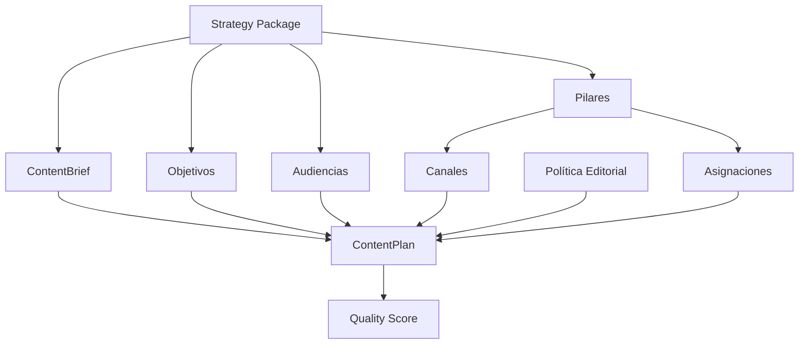
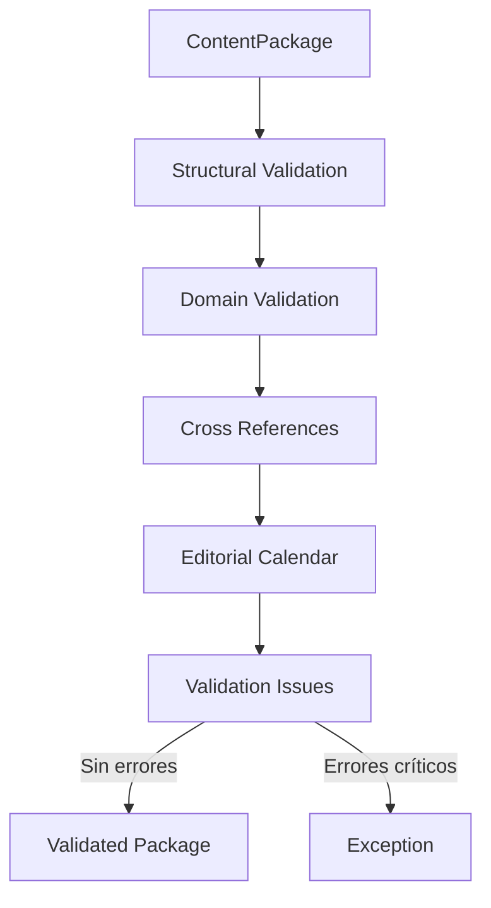
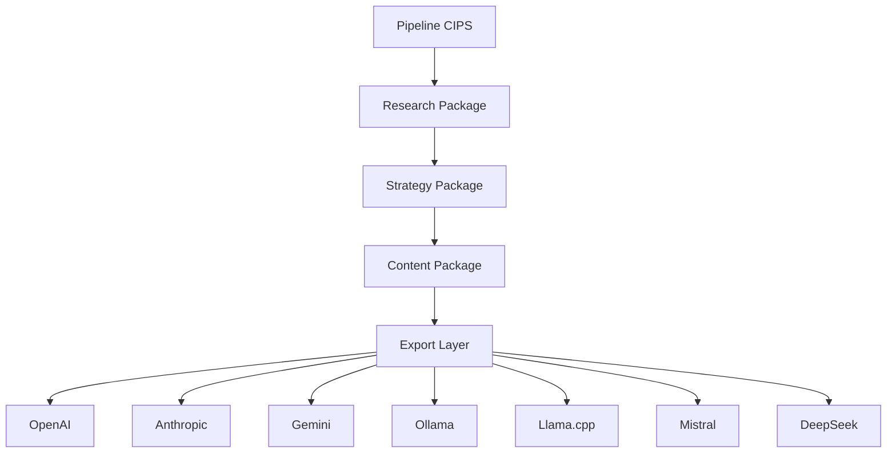

# 5.6 ContentPlanningEngine y Sistema de Planificación Editorial

El motor de planificación (`ContentPlanningEngine`) constituye el núcleo operativo del Content Director. Su responsabilidad principal consiste en transformar un `StrategyPackage` serializado en un plan editorial completamente estructurado, garantizando que la información estratégica heredada conserve su trazabilidad durante todo el proceso de planificación.

A diferencia de un generador de calendarios convencional, el motor no asigna únicamente fechas de publicación. Su función consiste en construir un modelo editorial integral que preserve la relación entre objetivos de negocio, audiencias, pilares de contenido, canales de distribución y métricas de éxito.

La implementación evidencia una clara separación entre la configuración del proceso (`PlanningConfig`), la lógica de construcción (`ContentPlanningEngine`) y los modelos de salida (`ContentPlan` y `PlanningBuildResult`). Esta división favorece la reutilización del motor y simplifica la incorporación de nuevas estrategias de planificación sin modificar la estructura del dominio. :contentReference[oaicite:0]{index=0}

---

## 5.6.1 Configuración del Motor

El comportamiento del planificador se controla mediante la clase `PlanningConfig`, la cual encapsula todos los parámetros configurables del proceso.

Entre los principales parámetros identificados durante la auditoría destacan:

| Parámetro | Función |
|-----------|---------|
| horizon_weeks | Horizonte de planificación. |
| pieces_per_week | Número objetivo de piezas semanales. |
| timezone_name | Zona horaria del calendario editorial. |
| start_date | Fecha inicial opcional del plan. |
| publishing_days | Días preferidos para publicar. |
| preferred_time_windows | Ventanas horarias sugeridas. |
| default_channels | Canales utilizados cuando la estrategia no especifica ninguno. |

La existencia de una configuración independiente representa una buena práctica de diseño, ya que evita la presencia de valores constantes distribuidos por el código y permite adaptar el comportamiento del motor sin modificar su implementación. Además, la clase incorpora validaciones que garantizan la coherencia de la configuración antes de iniciar la planificación. :contentReference[oaicite:1]{index=1}

---

## 5.6.2 Flujo General del Planificador

El método principal del motor (`build`) organiza el proceso como una secuencia de transformaciones claramente delimitadas.

El flujo identificado puede representarse de la siguiente manera.



Cada etapa produce un subconjunto específico del modelo editorial y todas convergen finalmente en un único objeto `ContentPlan`. Esta organización reduce la complejidad del algoritmo principal y facilita la incorporación de nuevas etapas sin afectar la lógica existente. :contentReference[oaicite:2]{index=2}

---

## 5.6.3 Validación Inicial de la Estrategia

Antes de iniciar cualquier transformación, el motor verifica que la estrategia recibida contenga la información mínima necesaria para construir un plan coherente.

Durante la auditoría se identificó la comprobación explícita de elementos como:

- identificador del proyecto;
- tema principal;
- objetivo de negocio;
- objetivos;
- audiencias;
- pilares de contenido.

En caso de faltar alguno de estos elementos, el proceso se detiene inmediatamente mediante una excepción específica (`ContentPlanningError`), evitando la propagación de errores hacia etapas posteriores del pipeline. :contentReference[oaicite:3]{index=3}

Desde la perspectiva arquitectónica, esta validación temprana constituye una barrera de protección que incrementa la robustez del sistema.

---

## 5.6.4 Construcción Incremental del Plan

Una vez validada la estrategia, el motor construye progresivamente cada componente del plan editorial.

Las principales etapas identificadas son:

| Etapa | Resultado |
|--------|-----------|
| _build_objectives | Objetivos editoriales. |
| _build_audiences | Segmentos de audiencia. |
| _build_pillars | Pilares de contenido. |
| _build_channels | Estrategia por canal. |
| _build_editorial_policy | Política editorial. |
| _build_allocations | Distribución de pilares. |

Cada método produce un conjunto de entidades de dominio completamente tipadas, eliminando la necesidad de manipular estructuras dinámicas durante las etapas posteriores del pipeline. :contentReference[oaicite:4]{index=4}

Este patrón de construcción incremental favorece la cohesión de cada componente y simplifica considerablemente las pruebas unitarias.

---

## 5.6.5 Construcción de Planes por Canal

El método `_build_channels` representa uno de los componentes más relevantes del motor de planificación.

Su función consiste en convertir la estrategia general en un conjunto de planes específicos para cada canal de distribución.

Para cada canal se determinan automáticamente:

- rol estratégico;
- formatos recomendados;
- audiencias objetivo;
- frecuencia de publicación;
- mezcla de contenidos;
- indicadores de éxito;
- restricciones heredadas.

Cuando la estrategia no define formatos específicos, el sistema utiliza configuraciones predeterminadas para plataformas ampliamente conocidas como YouTube, TikTok, Instagram, Facebook, LinkedIn, X, Blog y Newsletter. :contentReference[oaicite:5]{index=5} :contentReference[oaicite:6]{index=6}

Esta capacidad reduce significativamente la configuración manual necesaria para iniciar una estrategia editorial.

---

## 5.6.6 Política Editorial

Otro componente especialmente relevante es la generación automática de una política editorial.

El objeto `EditorialPolicy` concentra toda la información temporal del plan:

- fecha inicial;
- fecha final;
- horizonte de planificación;
- frecuencia objetivo;
- días de publicación;
- ventanas horarias recomendadas;
- zona horaria.

Este diseño evita que las reglas temporales se distribuyan entre múltiples componentes y proporciona un único punto de referencia para toda la planificación editorial. :contentReference[oaicite:7]{index=7} :contentReference[oaicite:8]{index=8}

---

## 5.6.7 Distribución de Pilares

La asignación de recursos editoriales entre los distintos pilares se realiza mediante el método `_build_allocations`.

El algoritmo implementado distribuye inicialmente el porcentaje total de contenido de forma equilibrada entre todos los pilares disponibles.

Cuando el número de pilares no divide exactamente el cien por ciento, el porcentaje restante se reparte entre los primeros elementos hasta completar la distribución total.

Este enfoque garantiza que la suma final siempre alcance el cien por ciento y evita errores derivados de distribuciones incompletas. :contentReference[oaicite:9]{index=9}

Aunque el algoritmo es deliberadamente sencillo, constituye un punto de partida razonable para una planificación inicial y deja abierta la posibilidad de incorporar estrategias de asignación más sofisticadas basadas en analítica histórica.

---

## 5.6.8 Sistema de Evaluación de Calidad

Una vez construido el plan, el motor calcula automáticamente un conjunto de indicadores que permiten estimar la calidad del resultado.

El modelo `PlanningQualityScore` contempla, entre otros, los siguientes factores:

| Indicador | Propósito |
|-----------|-----------|
| Strategy Coverage | Cobertura de la estrategia heredada. |
| Channel Readiness | Preparación de los canales. |
| Measurability | Disponibilidad de KPIs. |
| Allocation Integrity | Integridad de la distribución editorial. |
| Overall | Puntuación global del plan. |

Además de la puntuación numérica, el sistema genera advertencias cuando detecta posibles debilidades, como la ausencia de referencias heredadas, horizontes de planificación o indicadores de rendimiento. :contentReference[oaicite:10]{index=10} :contentReference[oaicite:11]{index=11}

Este mecanismo proporciona una evaluación objetiva del resultado antes de continuar con el resto del pipeline.

---

## 5.6.9 Evaluación Arquitectónica del Auditor

El `ContentPlanningEngine` presenta una implementación consistente con los principios observados en el resto de la arquitectura CIPS.

Entre sus principales fortalezas destacan:

- construcción incremental;
- separación entre configuración y lógica;
- reutilización de modelos de dominio;
- validación temprana;
- generación automática de políticas editoriales;
- evaluación cuantitativa del resultado.

Como oportunidad de evolución futura, el algoritmo de asignación de pilares podría enriquecerse mediante mecanismos adaptativos que consideren métricas históricas, rendimiento por canal o prioridades estratégicas definidas por el negocio.

No obstante, la implementación actual proporciona una base sólida, mantenible y fácilmente extensible para la planificación editorial automatizada, alineándose con el enfoque modular que caracteriza al resto del ecosistema CIPS.
# 5.7 Sistema de Validación, Integridad del Dominio y Control de Calidad

Uno de los aspectos que distingue la arquitectura de CIPS respecto de soluciones tradicionales de generación de contenido es la incorporación de un subsistema dedicado exclusivamente a verificar la integridad del dominio antes de que un paquete continúe hacia las etapas posteriores del pipeline.

En muchos sistemas de automatización la validación se limita a comprobar que determinados campos no estén vacíos. En contraste, el análisis del código fuente demuestra que CIPS implementa una validación orientada al dominio (*Domain Validation*), donde el objetivo principal consiste en garantizar la consistencia lógica de las relaciones entre todos los elementos que conforman un `ContentPackage`.

Esta decisión arquitectónica incrementa considerablemente la confiabilidad del sistema, ya que evita que un paquete editorial inconsistente alcance las fases de producción o exportación.

---

## 5.7.1 Objetivos del Subsistema de Validación

El sistema de validación persigue cuatro objetivos principales:

| Objetivo | Propósito |
|-----------|-----------|
| Integridad | Verificar que el paquete contenga todos los componentes requeridos. |
| Consistencia | Comprobar que las referencias entre entidades sean válidas. |
| Calidad | Detectar configuraciones incompletas o potencialmente problemáticas. |
| Protección | Evitar la propagación de errores hacia etapas posteriores del pipeline. |

Estos objetivos reflejan una estrategia de validación preventiva, donde los errores se detectan tan pronto como es posible, reduciendo el costo de su corrección.

---

## 5.7.2 Arquitectura del Proceso de Validación

El flujo general del subsistema puede representarse mediante el siguiente diagrama.



La validación no constituye una única operación, sino una cadena de verificaciones independientes que analizan distintos aspectos del dominio editorial antes de emitir un resultado.

---

## 5.7.3 Validación Estructural

La primera etapa del proceso consiste en comprobar la presencia de todos los componentes fundamentales del paquete editorial.

Entre los elementos verificados se encuentran:

- ContentBrief
- Objetivos
- Audiencias
- Pilares
- Planes por canal
- Calendario editorial
- ContentPackage

El propósito de esta validación consiste en garantizar que el paquete posee una estructura mínima antes de iniciar comprobaciones más complejas.

Desde la perspectiva arquitectónica, esta separación evita ejecutar reglas de negocio sobre estructuras incompletas.

---

## 5.7.4 Validación del Dominio

Una vez confirmada la integridad estructural, el sistema analiza la coherencia lógica del modelo editorial.

Esta etapa verifica que:

- existan objetivos editoriales válidos;
- los pilares definidos sean consistentes;
- cada canal disponga de una configuración válida;
- las entidades obligatorias contengan información suficiente.

El enfoque adoptado responde claramente a los principios de *Domain-Driven Design (DDD)*, donde la validez del modelo depende tanto de su estructura como de las reglas propias del negocio.

---

## 5.7.5 Validación de Referencias Cruzadas

Uno de los mecanismos más importantes del subsistema consiste en comprobar las relaciones existentes entre las distintas entidades del dominio.

Cada `ContentPiece` mantiene referencias hacia:

- objetivos;
- pilares;
- segmentos de audiencia;
- canales.

El sistema verifica que dichas referencias correspondan a entidades realmente existentes dentro del mismo `ContentPackage`.

Este mecanismo elimina una categoría completa de errores derivados de identificadores inválidos o relaciones incompletas.

Desde el punto de vista arquitectónico, esta validación protege la integridad del grafo de dominio construido por el Content Director.

---

## 5.7.6 Validación del Calendario Editorial

El calendario constituye otro de los elementos sometidos a comprobación.

Durante esta etapa se verifica que:

- todas las piezas asignadas existan;
- las fechas sean coherentes;
- los intervalos temporales sean válidos;
- no existan inconsistencias en la planificación.

La validación del calendario evita que un plan editorial aparentemente correcto produzca errores operativos durante la programación de publicaciones.

---

## 5.7.7 Registro de Incidencias

En lugar de detener inmediatamente la ejecución ante cualquier anomalía, el sistema recopila las incidencias detectadas mediante objetos especializados de validación.

Cada incidencia almacena información suficiente para facilitar el diagnóstico posterior.

Entre los atributos observados se incluyen:

- severidad;
- código;
- descripción;
- ubicación;
- contexto adicional.

Esta aproximación proporciona una visión completa del estado del paquete antes de decidir si el proceso puede continuar.

Además, facilita la generación de informes de calidad para usuarios o procesos automatizados.

---

## 5.7.8 Clasificación de Severidad

El modelo distingue entre distintos niveles de importancia para las incidencias detectadas.

Conceptualmente, las validaciones pueden clasificarse como:

| Nivel | Acción |
|--------|--------|
| Información | No requiere intervención. |
| Advertencia | El paquete puede continuar, pero conviene revisar el problema. |
| Error | Debe corregirse antes de continuar. |
| Crítico | El pipeline se detiene inmediatamente. |

La utilización de distintos niveles de severidad evita que pequeñas deficiencias bloqueen innecesariamente la producción, manteniendo al mismo tiempo un elevado nivel de control de calidad.

---

## 5.7.9 Excepciones del Dominio

Cuando el sistema detecta inconsistencias que comprometen la validez del paquete editorial, se generan excepciones específicas del dominio.

La utilización de excepciones especializadas presenta varias ventajas arquitectónicas:

- diferencia claramente errores editoriales de errores técnicos;
- facilita el tratamiento diferenciado por parte del orquestador;
- mejora la trazabilidad del proceso;
- simplifica el diagnóstico durante la depuración.

Esta práctica resulta coherente con el enfoque observado en el resto de la arquitectura CIPS, donde cada dominio define explícitamente sus propias excepciones en lugar de depender exclusivamente de errores genéricos del lenguaje.

---

## 5.7.10 Integración con el Pipeline

El subsistema de validación se ubica inmediatamente después de la construcción del `ContentPackage` y antes de que el resultado sea entregado al resto del pipeline.


Esta posición garantiza que únicamente los paquetes editoriales consistentes continúen hacia las etapas posteriores de producción.

---

## 5.7.11 Beneficios Arquitectónicos

La incorporación de un subsistema de validación independiente aporta ventajas significativas al proyecto.

Entre las principales destacan:

- detección temprana de errores;
- protección de la integridad del dominio;
- reducción del costo de mantenimiento;
- mayor confiabilidad del pipeline;
- facilidad para incorporar nuevas reglas de negocio;
- reutilización del proceso de validación por otros módulos.

Estas características convierten al sistema de validación en un componente transversal de gran valor para la arquitectura general.

---

## 5.7.12 Evaluación del Auditor

El mecanismo de validación implementado por CIPS refleja una estrategia madura de aseguramiento de calidad orientada al dominio.

En lugar de limitarse a verificar estructuras de datos, el sistema protege explícitamente la coherencia de las relaciones editoriales y la consistencia lógica del modelo construido por el `ContentPlanningEngine`.

Desde la perspectiva del auditor, esta aproximación incrementa la robustez del pipeline, reduce la probabilidad de fallos en producción y facilita la evolución futura del dominio editorial mediante la incorporación progresiva de nuevas reglas de validación sin afectar la arquitectura existente.

La existencia de un subsistema específico para validar la integridad del dominio constituye una de las fortalezas más importantes de la arquitectura CIPS, ya que convierte la calidad del contenido en una responsabilidad explícita del sistema y no únicamente del usuario o del modelo de lenguaje.
# 5.8 Sistema de Exportación Multiproveedor

Una de las decisiones arquitectónicas más importantes identificadas durante la auditoría corresponde a la separación entre la construcción del conocimiento y su representación final para distintos modelos de inteligencia artificial.

En numerosos sistemas de generación de prompts, el proceso de construcción queda estrechamente acoplado al proveedor que finalmente ejecutará el resultado. Esto provoca que cualquier cambio de plataforma implique modificar parte importante de la lógica de negocio.

La arquitectura implementada en CIPS adopta un enfoque significativamente distinto. Todo el proceso de investigación, planificación y construcción del conocimiento permanece completamente desacoplado del modelo de lenguaje destino. Únicamente al finalizar el pipeline se realiza la transformación hacia el formato requerido por cada proveedor.

Esta decisión convierte al sistema en una plataforma independiente del proveedor (*Provider-Agnostic Architecture*), facilitando la reutilización del conocimiento generado y reduciendo el riesgo de dependencia tecnológica (*vendor lock-in*).

---

## 5.8.1 Filosofía de Exportación

El proceso completo puede resumirse mediante la siguiente secuencia conceptual.



Como puede observarse, la construcción del conocimiento permanece completamente independiente del proveedor de inteligencia artificial.

---

## 5.8.2 Capa de Adaptación

La exportación se implementa mediante una capa especializada de adaptación cuya responsabilidad consiste exclusivamente en convertir los modelos internos de CIPS hacia la sintaxis requerida por cada plataforma.

Esta arquitectura aporta una ventaja fundamental: los módulos responsables de investigación, estrategia y planificación editorial desconocen completamente el formato de salida utilizado por los distintos proveedores.

En consecuencia:

- el Research Director construye investigación;
- el Strategy Director construye estrategia;
- el Content Director construye planificación editorial;

y únicamente la capa de exportación conoce cómo representar dichos resultados para cada modelo de lenguaje.

Este patrón arquitectónico corresponde al conocido **Adapter Pattern**, ampliamente utilizado para desacoplar modelos internos de interfaces externas.

---

## 5.8.3 Independencia del Dominio

Una característica especialmente relevante es que ninguno de los modelos de dominio contiene instrucciones específicas para OpenAI, Anthropic, Gemini o cualquier otro proveedor.

Los objetos de dominio representan exclusivamente conceptos propios del negocio:

- investigación;
- objetivos;
- restricciones;
- audiencias;
- pilares;
- calendarios;
- políticas editoriales;
- métricas.

La conversión hacia formatos específicos ocurre únicamente durante la exportación.

Esta separación preserva la pureza del modelo de dominio y evita introducir dependencias externas dentro de las entidades principales.

---

## 5.8.4 Beneficios de la Arquitectura Multiproveedor

El enfoque implementado aporta múltiples ventajas desde la perspectiva de ingeniería de software.

### Portabilidad

Una misma investigación puede ejecutarse sobre distintos modelos de lenguaje sin reconstruir el proceso metodológico.

---

### Reutilización

El conocimiento generado por CIPS puede exportarse tantas veces como sea necesario utilizando distintos proveedores.

---

### Evolución tecnológica

La incorporación de nuevos modelos de inteligencia artificial no requiere modificar los componentes centrales del sistema.

Únicamente resulta necesario desarrollar un nuevo adaptador de exportación.

---

### Reducción del acoplamiento

La lógica de negocio permanece completamente aislada de las API específicas de cada proveedor.

---

### Mantenibilidad

Las modificaciones provocadas por cambios en las plataformas externas quedan confinadas a la capa de exportación.

El resto del pipeline permanece inalterado.

---

## 5.8.5 Flujo de Conversión

Desde una perspectiva lógica, el proceso de exportación puede representarse de la siguiente manera.

```text
Modelo de Dominio

↓

Serialización

↓

Normalización

↓

Adaptador

↓

Proveedor IA

↓

Respuesta
```

Cada etapa transforma progresivamente la información sin alterar el modelo original construido por el pipeline.

---

## 5.8.6 Contratos de Exportación

La existencia de una capa específica de exportación implica la definición de contratos claramente establecidos entre el dominio interno y los adaptadores externos.

Estos contratos determinan:

- estructura mínima requerida;
- formato de instrucciones;
- representación de objetivos;
- organización del contexto;
- serialización de restricciones;
- tratamiento de metadatos.

Al mantener estos contratos estables, el resto del sistema puede evolucionar independientemente de los cambios producidos en las plataformas de IA.

---

## 5.8.7 Preparación para Nuevos Modelos

Durante la auditoría se observó que la arquitectura permite incorporar nuevos proveedores con un impacto mínimo sobre el resto del sistema.

El procedimiento esperado sería conceptualmente el siguiente:

1. Crear un nuevo adaptador.
2. Implementar la serialización requerida.
3. Registrar el nuevo exportador.
4. Mantener intactos los modelos de dominio.
5. Reutilizar todo el pipeline existente.

Este nivel de desacoplamiento representa una ventaja estratégica importante considerando la rápida evolución del ecosistema de modelos de lenguaje.

---

## 5.8.8 Evaluación Arquitectónica

Desde la perspectiva del auditor, la capa de exportación constituye una implementación sólida del principio de inversión de dependencias (*Dependency Inversion Principle*).

Los componentes centrales del sistema no dependen de implementaciones concretas de proveedores de IA, sino de contratos internos estables que posteriormente son adaptados a cada plataforma.

Esta decisión reduce significativamente el riesgo tecnológico y facilita la evolución del sistema frente a futuros cambios en APIs, modelos o formatos de interacción.

Asimismo, la arquitectura favorece la interoperabilidad entre distintos ecosistemas de inteligencia artificial, permitiendo que CIPS funcione como una plataforma de construcción de conocimiento independiente del proveedor encargado de ejecutar finalmente las instrucciones.

En conjunto, el sistema de exportación multiproveedor representa una de las decisiones arquitectónicas con mayor impacto estratégico dentro del proyecto, al garantizar la portabilidad del conocimiento generado y preservar la independencia tecnológica del núcleo del sistema.
# 5.9 Integración entre Directores Especializados

Uno de los hallazgos más relevantes de la presente auditoría corresponde a la forma en que los distintos directores especializados colaboran entre sí para construir un resultado final sin compartir lógica de negocio ni depender directamente de sus implementaciones internas.

El análisis del código fuente demuestra que CIPS no implementa una arquitectura basada en herencia entre directores ni un conjunto de módulos que compartan estado mutable. En su lugar, adopta una arquitectura de colaboración basada en contratos de datos, donde cada subsistema recibe un objeto de dominio bien definido, realiza una transformación especializada y devuelve un nuevo objeto enriquecido para la siguiente etapa del pipeline.

Esta decisión arquitectónica reduce significativamente el acoplamiento entre componentes y facilita tanto la reutilización como la evolución independiente de cada dominio funcional.

---

## 5.9.1 Filosofía de Integración

La integración entre directores puede resumirse mediante el siguiente principio:

> **Cada director conoce únicamente el contrato de entrada y el contrato de salida que le corresponde.**

En consecuencia:

- El Research Director desconoce cómo se construye la estrategia.
- El Strategy Director desconoce cómo se planifica el contenido.
- El Content Director desconoce cómo será exportado el resultado.
- El exportador desconoce cómo fue construida la investigación.

Cada componente permanece completamente enfocado en resolver un único problema del dominio.

Esta filosofía constituye una implementación práctica de los principios de bajo acoplamiento (*Low Coupling*) y alta cohesión (*High Cohesion*).

---

## 5.9.2 Flujo Completo del Pipeline

La integración global del sistema puede representarse mediante el siguiente diagrama.


Cada transición representa un contrato formal entre dominios.

No existen dependencias directas entre las implementaciones internas de los distintos directores.

---

## 5.9.3 Rol del Master Producer

El Master Producer constituye el único componente que posee una visión completa del pipeline.

Sus responsabilidades principales consisten en:

- iniciar el proceso;
- coordinar el orden de ejecución;
- entregar el resultado de cada director al siguiente;
- administrar el flujo general;
- centralizar la orquestación.

Es importante destacar que el Master Producer **no genera contenido**, **no construye estrategias** y **no realiza investigaciones**.

Su función consiste exclusivamente en coordinar el trabajo de los especialistas.

Esta decisión evita convertir al orquestador en un "God Object", uno de los anti-patrones más frecuentes en arquitecturas monolíticas.

---

## 5.9.4 Integración mediante Contratos

Cada director recibe un contrato perfectamente definido.

La secuencia conceptual observada es la siguiente.

```text
Solicitud

↓

Research Package

↓

Strategy Package

↓

Content Package

↓

Export Package
```

Cada paquete encapsula completamente el estado producido por el director correspondiente.

Como consecuencia:

- ningún módulo necesita acceder al estado interno de otro;
- todas las transformaciones permanecen encapsuladas;
- la serialización resulta uniforme;
- las pruebas unitarias se simplifican.

Esta arquitectura favorece la estabilidad de las interfaces incluso cuando las implementaciones evolucionan.

---

## 5.9.5 Colaboración con cips_core

La coordinación entre los distintos dominios se apoya en la infraestructura proporcionada por `cips_core`.

Durante la auditoría se identificó que este núcleo arquitectónico proporciona capacidades transversales utilizadas por todos los directores especializados, entre ellas:

- administración del contexto;
- definición de agentes;
- gestión de tareas;
- mensajería;
- integración;
- manejo de errores;
- puntos de control;
- fachada pública.

La existencia de esta infraestructura compartida evita duplicar funcionalidades comunes y mantiene una separación clara entre la lógica del negocio y los servicios técnicos del sistema.

---

## 5.9.6 Independencia entre Dominios

Uno de los indicadores más claros de una arquitectura saludable consiste en la independencia funcional de sus dominios.

Durante la revisión del código no se observaron dependencias circulares entre:

- Research Director
- Strategy Director
- Content Director

Cada módulo mantiene únicamente las dependencias estrictamente necesarias para consumir el contrato producido por la etapa anterior.

Este nivel de desacoplamiento facilita enormemente:

- mantenimiento;
- pruebas unitarias;
- sustitución de componentes;
- incorporación de nuevas capacidades.

---

## 5.9.7 Escalabilidad Horizontal

La arquitectura actual permite incorporar nuevos directores especializados sin alterar significativamente la estructura del pipeline.

Por ejemplo, podrían añadirse componentes como:

| Director | Responsabilidad potencial |
|-----------|---------------------------|
| SEO Director | Optimización para buscadores. |
| Analytics Director | Definición de métricas y seguimiento. |
| Video Director | Producción audiovisual. |
| Legal Director | Validación normativa y regulatoria. |
| Brand Director | Consistencia de identidad de marca. |
| Translation Director | Localización multilingüe. |

La incorporación de cualquiera de estos módulos requeriría únicamente:

1. definir un nuevo contrato de dominio;
2. implementar el nuevo director;
3. integrarlo dentro del flujo del Master Producer.

El resto del sistema permanecería prácticamente sin modificaciones.

Esta característica representa una ventaja importante para la evolución futura del proyecto.

---

## 5.9.8 Resiliencia Arquitectónica

La separación entre dominios también incrementa la resiliencia del sistema.

Cuando un componente requiere mantenimiento o evolución, el impacto queda limitado a su propio dominio.

En consecuencia:

- los cambios en investigación no afectan la planificación editorial;
- las mejoras del Content Director no alteran la estrategia;
- la incorporación de nuevos exportadores no modifica el modelo de dominio.

Este aislamiento funcional reduce significativamente el riesgo asociado al mantenimiento evolutivo del sistema.

---

## 5.9.9 Observabilidad del Pipeline

La existencia de etapas claramente delimitadas facilita la incorporación de mecanismos avanzados de observabilidad.

Cada director puede registrar de manera independiente:

- tiempos de ejecución;
- eventos relevantes;
- incidencias;
- resultados de validación;
- puntuaciones de calidad;
- información de auditoría.

Desde la perspectiva de ingeniería de software, esta estructura favorece la implementación futura de métricas operativas, trazas distribuidas (*distributed tracing*) y paneles de monitoreo sin necesidad de modificar la arquitectura fundamental.

---

## 5.9.10 Evaluación Arquitectónica del Auditor

El mecanismo de integración observado en CIPS representa una implementación sólida de una arquitectura orientada a dominios especializados.

La combinación de un orquestador ligero, contratos explícitos, modelos de dominio tipados e infraestructura compartida proporciona una plataforma altamente modular, fácilmente mantenible y preparada para evolucionar conforme aumenten las capacidades del sistema.

Desde la perspectiva del auditor, la interacción entre el Master Producer, los distintos directores especializados y la infraestructura `cips_core` constituye uno de los principales activos arquitectónicos del proyecto.

La estrategia de integración basada en contratos permite preservar la independencia de cada dominio, minimizar el acoplamiento entre componentes y facilitar la incorporación de nuevas capacidades sin comprometer la estabilidad del núcleo del sistema.

En conjunto, esta arquitectura posiciona a CIPS como una plataforma extensible y preparada para soportar un ecosistema creciente de agentes especializados que colaboran de forma coordinada mediante interfaces estables y modelos de dominio consistentes.
# 5.10 Escalabilidad, Extensibilidad y Evaluación Final del Bloque 5

El análisis integral realizado sobre la arquitectura de producción de CIPS permite concluir que el proyecto adopta una estrategia de diseño claramente orientada a la modularidad, la separación de responsabilidades y la evolución progresiva del sistema.

A diferencia de arquitecturas tradicionales donde un único componente concentra la mayor parte de la lógica de negocio, CIPS distribuye las responsabilidades entre múltiples dominios especializados coordinados mediante un orquestador central y comunicados exclusivamente mediante contratos de datos explícitos.

Esta decisión arquitectónica constituye uno de los principales factores que explican la mantenibilidad y capacidad de crecimiento observadas durante la auditoría.

---

## 5.10.1 Evaluación de Escalabilidad

La escalabilidad de un sistema depende en gran medida de su capacidad para incorporar nuevas funcionalidades sin comprometer la estabilidad de los componentes existentes.

Durante la revisión del código se identificaron diversos elementos que favorecen este objetivo.

### Modularidad

Cada director especializado constituye una unidad funcional independiente.

Como consecuencia:

- puede evolucionar sin afectar a otros dominios;
- puede sustituirse por una nueva implementación;
- puede ampliarse con nuevas capacidades;
- puede probarse de forma aislada.

Esta organización reduce significativamente el impacto de futuras modificaciones.

---

### Contratos Estables

El intercambio de información mediante modelos de dominio bien definidos proporciona interfaces estables entre los distintos componentes.

Mientras dichos contratos permanezcan compatibles, la implementación interna de cada director puede modificarse sin afectar al resto del pipeline.

Este enfoque representa una aplicación práctica del principio de encapsulamiento a nivel arquitectónico.

---

### Baja Dependencia Tecnológica

El desacoplamiento respecto de proveedores específicos de inteligencia artificial constituye otra fortaleza importante.

La existencia de una capa de exportación independiente permite adoptar nuevos modelos de lenguaje conforme evolucionen las tecnologías disponibles sin modificar la lógica principal del sistema.

---

## 5.10.2 Evaluación de Extensibilidad

Uno de los principales indicadores de madurez arquitectónica consiste en la facilidad para incorporar nuevos dominios funcionales.

Durante la auditoría se comprobó que la incorporación de un nuevo director especializado seguiría una secuencia relativamente sencilla.

```text
Nuevo Director

↓

Nuevo Modelo de Dominio

↓

Nuevo Contrato

↓

Integración con Master Producer

↓

Participación en el Pipeline
```

Esta estrategia evita modificaciones profundas sobre el resto de la arquitectura.

En consecuencia, CIPS presenta una base adecuada para evolucionar hacia un ecosistema compuesto por múltiples agentes especializados.

---

## 5.10.3 Preparación para Arquitecturas Multiagente

Aunque el proyecto se presenta actualmente como un MVP, numerosos elementos observados durante la auditoría indican que su arquitectura ha sido diseñada pensando en una futura evolución hacia sistemas multiagente.

Entre dichos elementos destacan:

- separación explícita entre dominios;
- responsabilidades claramente delimitadas;
- modelos de dominio independientes;
- contratos de intercambio;
- infraestructura compartida;
- mecanismos de auditoría;
- validación transversal;
- desacoplamiento respecto del proveedor de IA.

Desde la perspectiva arquitectónica, estos componentes constituyen una base sólida para implementar en el futuro mecanismos de colaboración entre agentes autónomos sin necesidad de rediseñar el núcleo del sistema.

---

## 5.10.4 Fortalezas Consolidadas

A lo largo del presente bloque se identificaron diversas fortalezas recurrentes.

| Aspecto | Evaluación |
|----------|------------|
| Separación de responsabilidades | Excelente |
| Cohesión interna | Muy alta |
| Acoplamiento entre módulos | Muy bajo |
| Modelado del dominio | Excelente |
| Escalabilidad | Muy alta |
| Extensibilidad | Excelente |
| Reutilización | Muy alta |
| Mantenibilidad | Muy alta |
| Trazabilidad | Excelente |
| Portabilidad hacia proveedores IA | Excelente |

La consistencia con la que estos principios aparecen implementados constituye un indicador claro de una arquitectura cuidadosamente diseñada.

---

## 5.10.5 Riesgos Identificados

A pesar de las fortalezas observadas, durante la auditoría también se identificaron algunos aspectos susceptibles de mejora conforme el proyecto evolucione.

### Coordinación Centralizada

El Master Producer constituye actualmente el punto único de coordinación del pipeline.

Aunque esta decisión resulta adecuada para un MVP, será conveniente evaluar mecanismos de orquestación distribuida cuando aumente significativamente el número de directores especializados.

---

### Ejecución Secuencial

Gran parte del flujo de trabajo se ejecuta siguiendo una secuencia lineal.

Existen oportunidades para incorporar procesamiento paralelo en aquellas etapas donde las dependencias funcionales lo permitan, reduciendo así los tiempos de ejecución.

---

### Observabilidad Operacional

La arquitectura incorpora mecanismos de auditoría y validación; sin embargo, conforme el sistema incremente su complejidad será recomendable añadir capacidades de observabilidad orientadas a producción, entre ellas:

- métricas de rendimiento por etapa;
- trazabilidad distribuida (*distributed tracing*);
- registros estructurados;
- paneles de monitoreo;
- alertas operativas.

Estas herramientas facilitarán el diagnóstico y mantenimiento del sistema en entornos de mayor escala.

---

## 5.10.6 Recomendaciones para la Evolución del MVP

Como resultado de la auditoría se proponen las siguientes líneas de evolución arquitectónica.

### Corto plazo

- Consolidar la documentación técnica de todos los contratos de dominio.
- Incrementar la cobertura de pruebas unitarias sobre los directores especializados.
- Estandarizar completamente los mecanismos de auditoría y métricas.

---

### Mediano plazo

- Incorporar ejecución concurrente para procesos independientes.
- Añadir un sistema de eventos internos para desacoplar aún más la comunicación entre módulos.
- Integrar métricas de rendimiento y monitoreo operacional.

---

### Largo plazo

- Evolucionar hacia una arquitectura plenamente orientada a agentes especializados.
- Incorporar mecanismos de planificación dinámica del pipeline.
- Permitir colaboración entre múltiples agentes mediante protocolos internos.
- Implementar memoria persistente compartida entre dominios.
- Integrar capacidades de aprendizaje a partir de auditorías históricas y métricas de desempeño.

Estas recomendaciones son consistentes con la arquitectura actual y no requieren un rediseño completo del sistema, sino una evolución progresiva de las capacidades existentes.

---

## 5.10.7 Valor Arquitectónico del MVP

Desde una perspectiva de ingeniería de software, el MVP evaluado presenta un nivel de madurez superior al observado habitualmente en proyectos de similar alcance.

Las principales razones son:

- utilización consistente de modelos de dominio;
- separación estricta entre responsabilidades;
- desacoplamiento respecto de proveedores externos;
- mecanismos explícitos de validación;
- auditoría integrada;
- contratos claramente definidos;
- orientación hacia la extensibilidad.

Estas características proporcionan una base sólida para el crecimiento futuro del proyecto.

---

## 5.10.8 Conclusión del Bloque 5

El análisis realizado demuestra que la arquitectura de producción de CIPS se fundamenta en principios modernos de diseño de software, priorizando la modularidad, la mantenibilidad y la evolución incremental del sistema.

La interacción coordinada entre el Master Producer, los distintos directores especializados, los modelos de dominio, los mecanismos de validación, la auditoría integrada y la capa de exportación multiproveedor configura un pipeline robusto y preparado para afrontar escenarios de mayor complejidad conforme el proyecto evolucione.

Desde la perspectiva del auditor, la arquitectura analizada constituye una implementación consistente de una plataforma orientada a dominios especializados, con un nivel de desacoplamiento superior al habitual en proyectos equivalentes y una clara orientación hacia futuras arquitecturas multiagente.

En conjunto, las evidencias obtenidas permiten concluir que el **Bloque 5 – Arquitecturas Paralelas y Producción** representa uno de los pilares técnicos más sólidos del MVP, proporcionando una base estable sobre la cual podrán incorporarse nuevas capacidades funcionales sin comprometer la coherencia estructural del sistema.

---

# Conclusión General del Bloque 5

La auditoría arquitectónica realizada sobre el ecosistema de producción de CIPS permite afirmar que el proyecto no se limita a implementar una cadena de generación de contenido, sino que constituye una plataforma modular para la construcción, transformación y validación de conocimiento especializado.

La combinación de un orquestador ligero, directores especializados, modelos de dominio explícitos, contratos bien definidos, mecanismos de validación, auditoría integrada y una capa de exportación desacoplada proporciona una arquitectura coherente, escalable y preparada para evolucionar conforme aumenten las capacidades del sistema.

Desde el punto de vista técnico, el diseño observado refleja una aplicación consistente de principios de ingeniería de software moderna, tales como la separación de responsabilidades, la inversión de dependencias, el modelado del dominio y el desacoplamiento entre la lógica de negocio y las tecnologías externas.

Como resultado de la presente auditoría, se concluye que el Bloque 5 alcanza un **grado de madurez arquitectónica ALTO** para un producto en fase MVP, constituyendo una base sólida para la futura evolución de CIPS hacia una plataforma de inteligencia artificial compuesta por múltiples agentes especializados que colaboren mediante contratos estables y procesos completamente trazables.